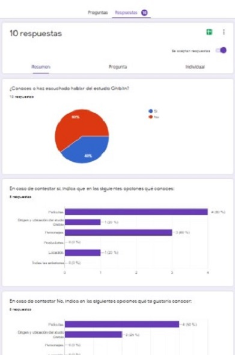
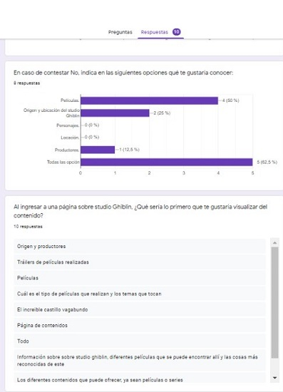
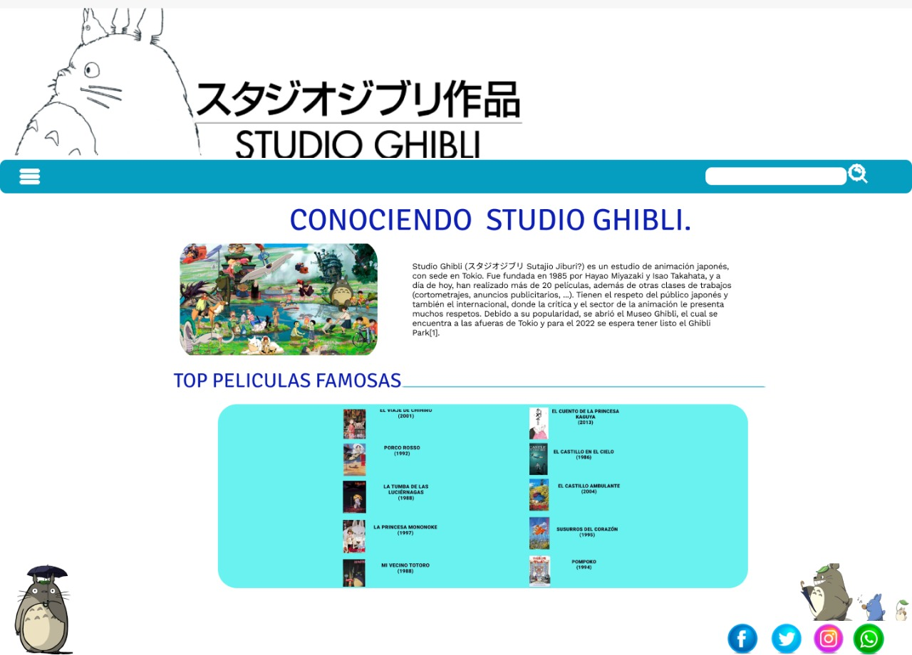
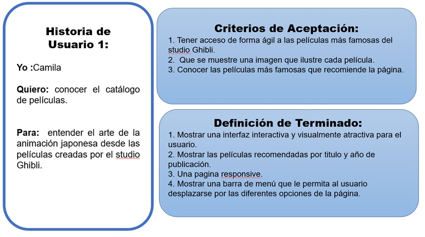
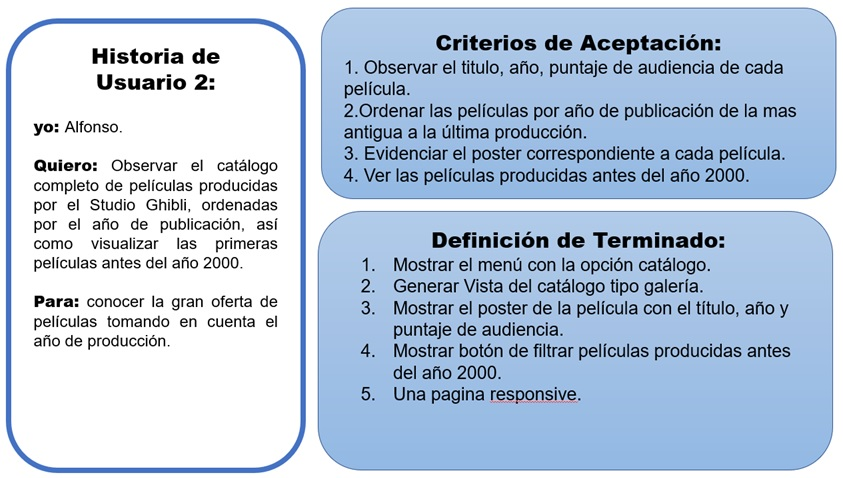
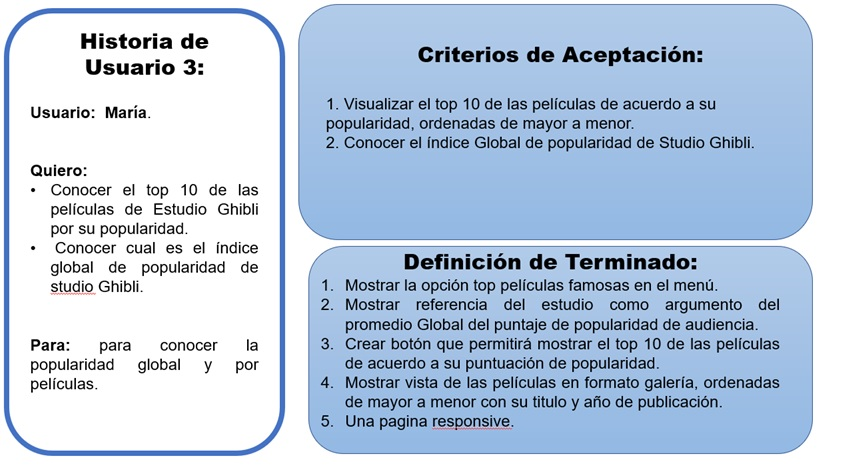
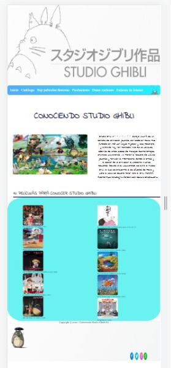
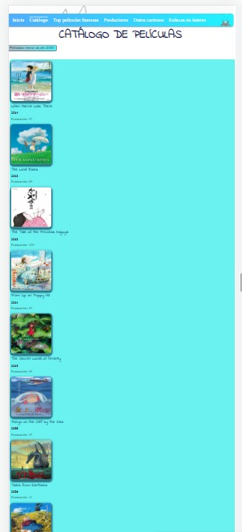
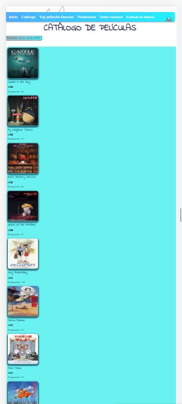
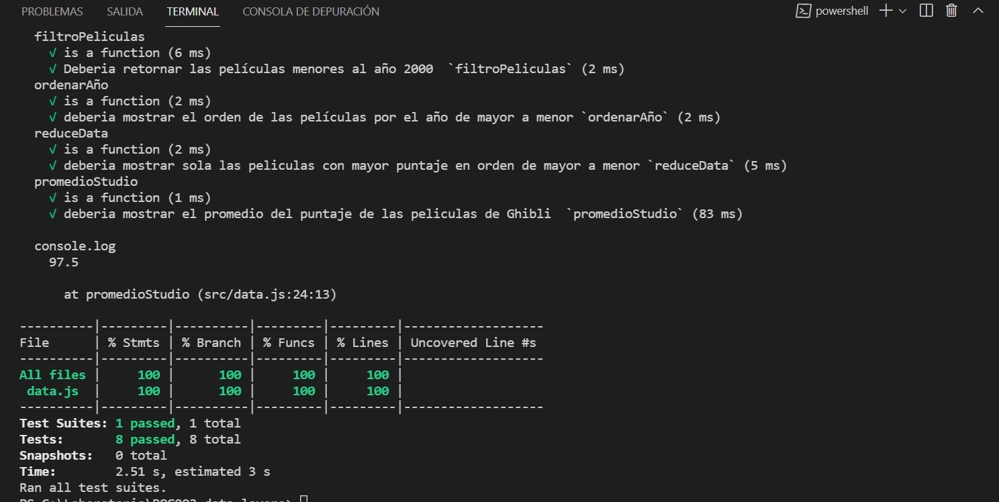

# Data Lovers

## Índice

* [1. Preámbulo](#1-preámbulo)
* [2. Resumen del proyecto](#2-resumen-del-proyecto)
* [3. Prototipos de baja y alta fidelidad](#3-prototipos-de-baja-y-alta-fidelidad)
* [4. Historias de usuarios](#4-Historias-de-usuarios)
* [5. Producto final](#5-producto-final)
* [6. Pruebas unitarias](#6-pruebas-unitarias)

***

## 1. Preámbulo

Esta pagína esta diseñada para personas que no tienen conocimiento de las peliculas producidas por Studio Ghibli pero con interes de conocer un poco sobre las producciones de anime realizadas por esta productora.

## 2. Resumen del proyecto

El proyecto "Conociendo a Studio Ghibli" tiene como finalidad informar y documentar a los fans y/o nuevos usuarios sobre las producciones, ofreciendo un amplio catálogo de las peliculas (desde sus inicios hasta la actualidad organizadas cronológicamente).Adicionalmente a través de la sección Top 10 películas famosas se visualizará un promedio basado en "Rotten Tomatoes" sobre la popularidad de adudiencia.

## 3. Prototipos de baja y alta fidelidad

Se realizó un análisis a partir de una encuesta realizada a posibles usuarios, que arrojaron como resultado la necesidad de tener un diseño que permita la interacción con el catálogo de peliculas, reseñas, año de producción y una breve reseña de que es Studio Ghibli.

### Prototipo de baja fidelidad:

Primer diseño baja fidelidad:

 
 El prototipo de baja fidelidad se sometió a cambios como resultado del feedback de coach, compañeras y posibles usuarios.

### Prototipo de alta fidelidad:

Los siguientes prototipos fueron basados en las historias de Usuarios a desarrollar.

## 4. Historias de Usuario.

Se planteraon tres historias pensadas en usuarios  que no tenían conocimiento previo en peliculas de anime y productoras dedicadas a este género.

### 5. Producto Final.

### 6. Pruebas unitarias

El resultado del test fue del 100%, se testearon 4 funciones: metodos (filter,sort y reduce). Permitiendo al usuario el manejo de la data por el año de publicación de la pelicula y el puntaje del ranking de popularidad.

